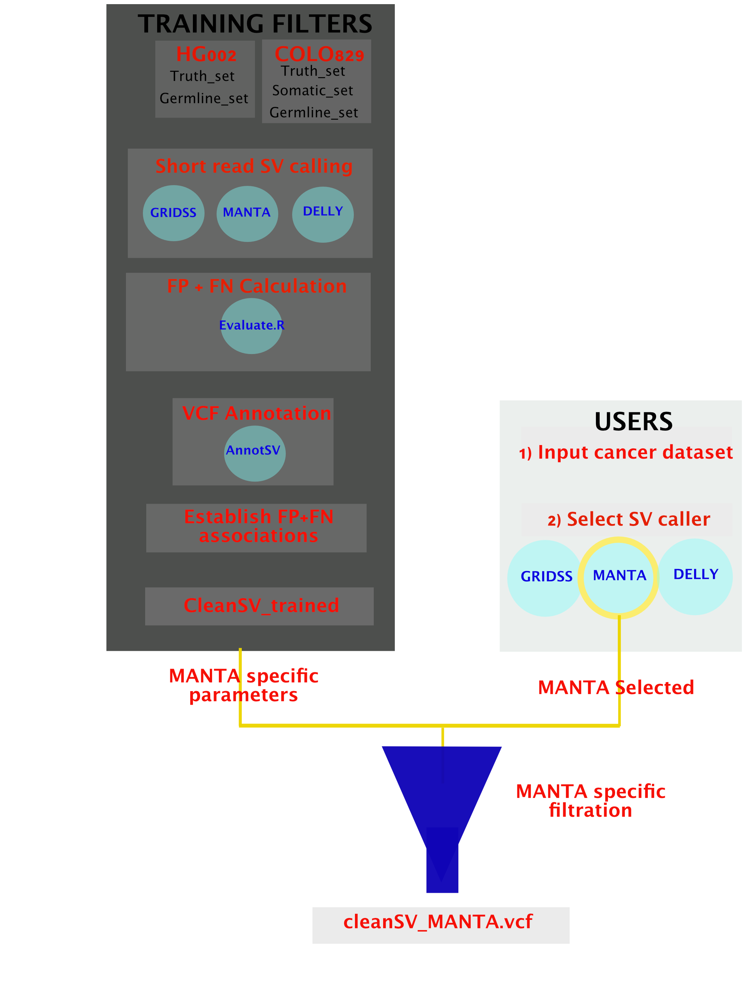

# CleanSV

  

[Slides](https://github.com/collaborativebioinformatics/CleanSV/blob/main/SV_filter_12Oct2020.pdf)

## Contributors
Evan Biederstedt

Daniel Cameron

Ann McCartney, NIH

Jim Havrilla

Divya Kalra

Michael Khayat

Jingwen Ren

Najeeb Syed

Angad Jolly

## Workflow

  

## What's the problem?

Within clinical genomics, short-read sequencing is performed in order to inform/direct patient care. This has been immensely successful. 

For various Mendelian disorders, patients have their genomes sequenced to look for high-quality germline SNPs. 

Within precision oncology, tumors are sequenced for somatic variants in oncogenes/tumor suppressor genes. Based upon these variants, specific chemotherapies could be prescribed in order to target those malignant cells (e.g. inhibit them from growing further.)

Bioinformaticians will look at the calls within IGV in order to validate how accurate they are, and then send these reports to clinicians. 

Short-read calling of SVs is marred by high false positive call rates. There are few scalable methods to filter FPs. 

## Why should we solve it?

Access to SV calls from short-read sequencing with a lower false positive call rate would benefit both research and clinical analysis of Mendelian disorders or tumors. 

Having a higher quality SV call set would help reduce the time required to follow up candidate genes and help identify therapeutic targets in the research setting, and would help identify true pathogenic variants in the clinical diagnostic setting. 

Moreover, it would enhance the ability to detect somatic variation using subtraction methods which rely on germline and somatic sequencing data as input. With a lower false positive call rate, presumably fewer somatic variants would be called and a higher proportion would be true positive calls. 

# What is CleanSV?

The major goals of this software are to: 

1: Provide researchers with empirically determined guidelines for SV filtering

2: Provide a visualization of false positive rates of current SV callers using 60 samples from the PCAWG dataset

3: Perform germline variant call filtering within the HG002 and HG003 datasets using filter criteria based on systematic issues identified in false positive call analysis. 

4: Provide a simple program to filter out obvious false positives using the identified criteria

